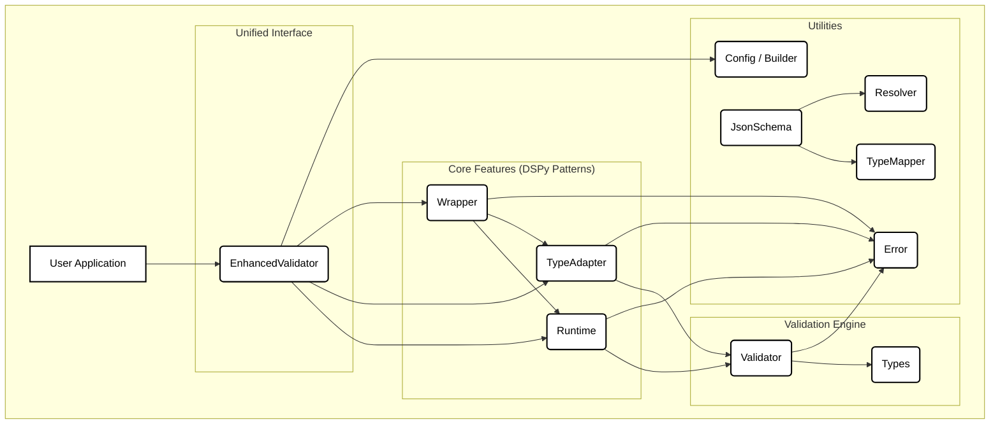

# Exdantic Architecture Diagrams

### Diagram 1: Overall Architecture & Module Dependencies

This diagram shows the high-level components of the Exdantic library and their primary dependencies. The architecture is layered, with the `EnhancedValidator` serving as a unified entry point that delegates to specialized modules.

### Diagram 2: Validation Flow

This flowchart illustrates the decision-making process and execution path for a typical validation call initiated through the `EnhancedValidator`.

```mermaid
flowchart TD
    subgraph " "
        style A fill:#fff,stroke:#000,stroke-width:2px,color:#000
        style B fill:#fff,stroke:#000,stroke-width:2px,color:#000
        style C fill:#fff,stroke:#000,stroke-width:2px,color:#000
        style D fill:#fff,stroke:#000,stroke-width:2px,color:#000
        style E fill:#fff,stroke:#000,stroke-width:2px,color:#000
        style F fill:#fff,stroke:#000,stroke-width:2px,color:#000
        style G fill:#fff,stroke:#000,stroke-width:2px,color:#000
        style H fill:#fff,stroke:#000,stroke-width:2px,color:#000
        style I fill:#fff,stroke:#000,stroke-width:2px,color:#000
        style J fill:#fff,stroke:#000,stroke-width:2px,color:#000
        style K fill:#fff,stroke:#000,stroke-width:2px,color:#000
        style L fill:#fff,stroke:#000,stroke-width:2px,color:#000
        style M fill:#fff,stroke:#000,stroke-width:2px,color:#000

        A(Start: EnhancedValidator.validate) --> B{Target Type?}
        
        B -->|Runtime Schema| C[Runtime.validate]
        B -->|Compiled Schema| D[Validator.validate_schema]
        B -->|Type Spec| E[TypeAdapter.validate]
        
        C --> F[Validate Fields & Required]
        D --> F
        E --> F
        
        F --> G{Coercion Enabled?}
        G -->|Yes| H[Types.coerce]
        G -->|No| I["Validator.validate (recursive)"]
        H --> I
        
        I --> J[Apply Constraints]
        J --> K{Validation Success?}
        
        K -->|Yes| L["Return {:ok, validated_data}"]
        K -->|No| M["Return {:error, [errors]}"]
    end
```

